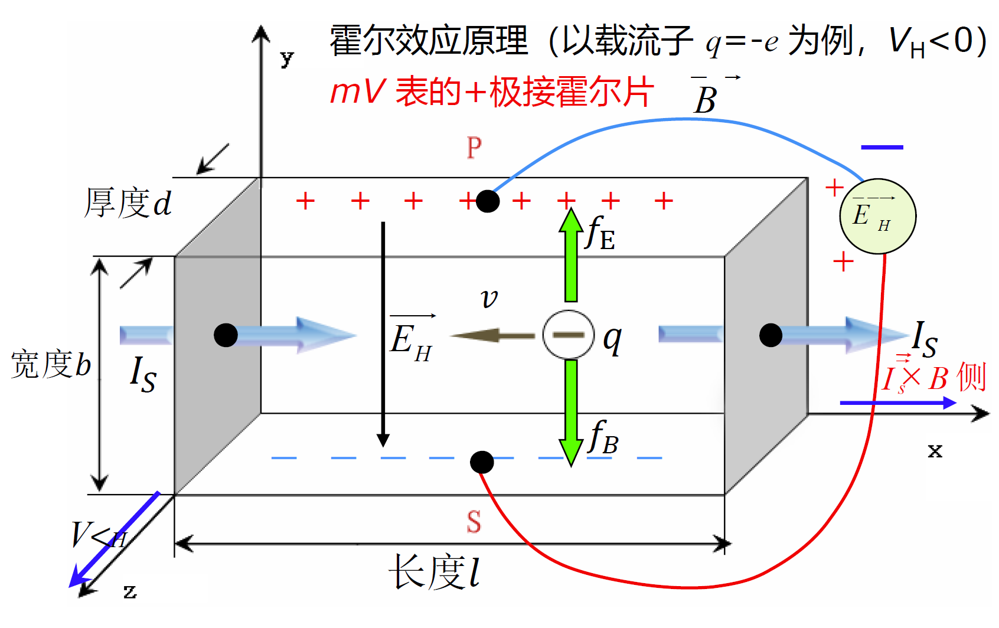
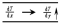
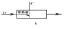
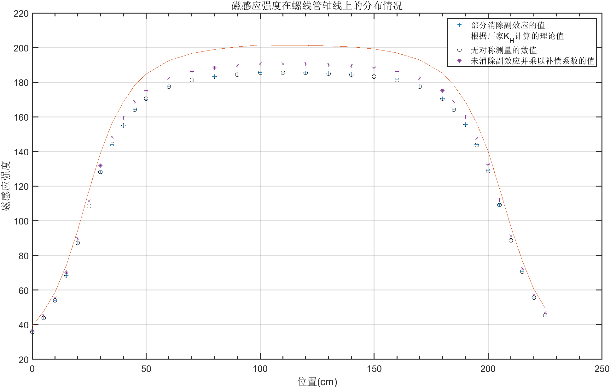

# 实验目的

* 掌握霍尔效应原理
* 学习引用霍尔效应进行简单测量的方法
* 学习消除霍尔效应副效应的实验方法——对称测量法

# 实验主要仪器设备

霍尔片：N型砷化镓半导体；通电螺线管。

# 实验原理及内容

> 包括基本原理阐述、主要的原理公式和数据处理方法、相关电路、光路及实验装置示意图

### 霍尔效应现象：
金属或半导体薄片通以电流$I$，被放入垂直于电流方向的磁场$B$中，在垂直于磁场和电流的方向上可检测到电势差$V_H$。



通过霍尔片的电流$I_s$对应载流子$q(q=±e)$的定向运动，载流子$q$在磁场$B$中运动会受洛伦兹力的作用，力的方向是$I_s×B$，载流子$q$聚集在受力方向对应的霍
尔片$P$或$S$一侧，形成静电场$E_H$，后续的载流子$q$在电
场力和洛伦兹力共同作用下达到力的平衡：
$$
\because\,f_E=f_B\therefore\,qE_H=qvB,霍尔电压：V_H=R_HI_SB/b=bE_H=vbB\\霍尔片通过的电流是I_S，设载流子浓度是n(单位体积)，速度是v，b为宽，d为高\\\therefore\,I_S=\frac{dQ}{dt}=\frac{qn\,dV}{dt}=\frac{qn(b\cdot d\cdot v\,dt)}{dt}=qnvbd\\\therefore{vb}=\frac{I_S}{nqd}\\\therefore\,V_H=vbB=\frac{I_S}{nqd}B=\frac1{nq}\frac{I_SB}d
$$
对于半导体霍尔片：
$$
\vec{V_H}=\frac{3\pi}{8nq}\frac{\vec{I_S}×\vec{B}}d
$$
对金属霍尔系数是：$\frac1{nq}=-\frac1{ne}$；对半导体霍尔系数是：$\frac{3\pi}{8nq}$；具体对$N$型是$-\frac{3\pi}{8ne}$，$P$型是$\frac{3\pi}{8ne}$。

### 霍尔效应中的副效应

#### 里纪-勒杜克效应，VRL



纵向热扩散电流，在磁场的作用下，从而在y轴方向引起类似爱廷豪森效应，产生横向温差，这一横向温差又引起横向电位差，为里纪-勒杜克电压VRL 。VRL的方向只与Ｂ的方向有关。该效应很弱。

#### 不等位效应，Vo



制备霍尔样品时,  y方向的测量电极很难做到处于理想的等位面上，即使在未加磁场时，在Ａ、Ｂ两电极间也存在一个由于不等位电势引起的欧姆压降V0，V0的方向只与Is的方向有关。该效应可较大。

# 主要实验步骤

1. 将霍尔片定位在螺线管正中，注意各按键位置（按下两个VH按键）：霍尔片在螺线管最右端刻度13.0mm，在最左215.0mm,设置霍尔片在螺线管正中心的坐标应是：13.0+(215-13.0)/2=114mm  (一般是114-115mm)

2. Is=0，IM=0时，开机，预热后对mV表校零，使VH=0

3. 按表格1(P309)，设定IM = 0.5A，IS 从0开始，每次增加0.5mA，用对称测量法记录对应的V，研究VH与Is的线性关系，由拟合斜率K1得到RH1

4. 按表格2(P309)，设定IS=3mA，IM从0开始，每次增加50mA，用对称测量法记录对应的，研究VH和IM的线性关系，由拟合的斜率K2得到RH2

5. 由RH1和RH2计算平均RH

6. 由半导体表达式RH计算载流子密度n

7. 计算霍尔灵敏度KH

8. 用已知霍尔系数的霍尔器件测量螺线管磁场分布取Is=+3mA，IM=+0.5A，并保持Is、IM变，从螺线管左端至右端，每间隔10mm改变霍尔元件位置，测量螺线管轴线上各点的霍尔压，求出轴线上各点的磁感应强度 ，绘制螺线管轴线上磁场的分布曲线，与理论值对比。

  > 注：书上P309表3简化为直接用单次+Is,+IM均正向的VH，未进行副效应补偿。并且，电流的热效应会影响霍尔原件的性能。

# 实验数据

> 要求列表，将整理后的原始数据填入表内，注意标明单位和测量数据的有效位数，并将老师签字的原始数据单附在此页

表一

| Vh-Is    |       |       |        |        |
| -------- | ----- | ----- | ------ | ------ |
| Is       | Is+Im | Is-Im | -Is-Im | -Is+Im |
| 0.50     | 0.58  | -0.49 | 0.48   | -0.58  |
| 1.00     | 1.15  | -0.96 | 0.96   | -1.15  |
| 1.50     | 1.73  | -1.45 | 1.45   | -1.73  |
| 2.00     | 2.29  | -1.93 | 1.93   | -2.31  |
| 2.50     | 2.87  | -2.41 | 2.41   | -2.88  |
| 3.00     | 3.44  | -2.89 | 2.89   | -3.46  |
| Im=500mA |       |       |        |        |

表二

| Vh-Im     |       |       |        |        |
| --------- | ----- | ----- | ------ | ------ |
| Im        | Is+Im | Is-Im | -Is-Im | -Is+Im |
| 50        | 0.61  | -0.34 | 0.33   | -0.63  |
| 100       | 0.92  | -0.35 | 0.34   | -0.94  |
| 150       | 1.24  | -0.67 | 0.67   | -1.25  |
| 200       | 1.56  | -0.98 | 0.98   | -1.57  |
| 250       | 1.86  | -1.30 | 1.29   | -1.88  |
| 300       | 2.18  | -1.62 | 1.60   | -2.20  |
| 350       | 2.49  | -1.93 | 1.93   | -2.51  |
| 400       | 2.81  | -2.25 | 2.25   | -2.83  |
| 450       | 3.13  | -2.57 | 2.57   | -3.14  |
| 500       | 3.44  | -2.89 | 2.89   | -3.46  |
| Is=3.00mA |       |       |        |        |

其中，观察前两个表的数据发现，V_2和V_3大多相差不大，V_1和V_4相差不大，所以在记录磁场分布情况时，可以只记录V_1和V_2的数据（但是当时我脑子犯傻了...只记录了V_1和V_4的数据）。总之，这样可以在减小工作量的情况下得到更加精确的数值。

表三

| X    | V_1  | V_4   | X    | V_1  | V_4   |
| ---- | ---- | ----- | ---- | ---- | ----- |
| 0    | 0.67 | -0.68 | 120  | 3.47 | -3.47 |
| 5    | 0.82 | -0.82 | 130  | 3.46 | -3.47 |
| 10   | 1.01 | -1.01 | 140  | 3.45 | -3.46 |
| 15   | 1.28 | -1.28 | 150  | 3.43 | -3.44 |
| 20   | 1.63 | -1.63 | 160  | 3.39 | -3.40 |
| 25   | 2.03 | -2.03 | 170  | 3.32 | -3.33 |
| 30   | 2.40 | -2.40 | 180  | 3.19 | -3.20 |
| 35   | 2.70 | -2.69 | 185  | 3.07 | -3.07 |
| 40   | 2.90 | -2.91 | 190  | 2.91 | -2.91 |
| 45   | 3.07 | -3.08 | 195  | 2.69 | -2.70 |
| 50   | 3.19 | -3.18 | 200  | 2.41 | -2.42 |
| 60   | 3.32 | -3.32 | 205  | 2.04 | -2.05 |
| 70   | 3.39 | -3.39 | 210  | 1.66 | -1.67 |
| 80   | 3.43 | -3.43 | 215  | 1.32 | -1.33 |
| 90   | 3.45 | -3.46 | 220  | 1.04 | -1.05 |
| 100  | 3.47 | -3.48 | 225  | 0.85 | -0.86 |
| 110  | 3.47 | -3.47 | 230  | 0.71 | -0.71 |

# 数据处理及实验结果

> 按照要求处理实验数据，要有主要的计算过程以及最后的实验结果，可以用计算机辅助作图

根据表一，表二计算
$$
V_H=\frac{V_1-V_2+V_3-V_4}{4}
$$
计算过程：

```matlab
% 导入数据，dataS1 dataS2 dataS3来源于data.xlsx，存储于matlab.mat
Is = dataS1.Is;
Im = dataS2.Im;
X = dataS3.X;

% 计算V_H
VH_1 = table2array(dataS1(:,2:end)) * ([1 -1 1 -1]') ./ 4;
VH_2 = table2array(dataS2(:,2:end)) * ([1 -1 1 -1]') ./ 4;
VH_3 = table2array(dataS3(:,2:end)) * ([1 -1]') ./ 2; % 简单对称测量的数值
VH_31 = table2array(dataS3(:,2)); % 无对称测量的数值
```

根据公式进行无限长螺线管近似，有：
$$
V_H=R_{H}\frac{\mu_0N\cdot I_M\cdot I_S}{Ld}
$$
可见，在I_S和I_M其中一项固定的情况下，V_H与另一项有正比例关系，所以根据实验数据进行拟合（见附图），得出a系数，该系数有
$$
a = R_{H1}\frac{\mu_0NI_M}{Ld}\,或\,a=R_{H2}\frac{\mu_0NI_S}{Ld}
$$
已知mu_0*N/L/d=0.181*0.0002/(4*10e-7*1800*)=0.4525/9

故通过算出R_{H1}和R_{H2}并得出算术平均数作为 R_H=0.032067440352919\frac{m^3}{C}

中间变量有：

* a1(tRH_1) = 0.945846107788446

* a2(tRH_2) = 0.006347272727273

计算过程：

```matlab
% 计算R_H，进行拟合
% 已知函数肯定经过原点（调零了），所以去掉常数项   
f=fittype('RH*x','independent','x','coefficients',{'RH'}); 
[cfun1,rsquare1]=fit(VH_1, Is,f);
[cfun2,rsquare2]=fit(Im, VH_2,f);
tRH_1 = cfun1.RH;
tRH_2 = cfun2.RH;

% 0.181*0.0002/(4*10e-7*1800*)=0.4525/9 所以手动解决复杂计算

RH_1 = tRH_1 * 0.4525/(9*0.5*pi);
RH_2 = tRH_2 * 0.4525/(9*0.003*pi);
RH = (RH_1 + RH_2) / 2;
```

由半导体表达式RH计算载流子密度n
$$
R_H = \frac{3\pi}{8ne}\to n=\frac{3\pi}{8eR_H}
$$
n = 2.293012652378947e+20 m^{-3}

计算过程：

```matlab
% 载流子密度n
d = 0.0002; % 霍尔元件厚度
ec = 1.602176634e-19; % 电子电荷量
n = 3*pi/(8*ec*RH);
```

计算霍尔灵敏度K_H，根据公式：
$$
K_H = \frac{R_H}{d}
$$
K_H = 160.337201764594 mV/mA\cdot T

计算过程：

```matlab
% 计算霍尔灵敏度KH
KH = RH/d;
```

厂家提供的K_H为174mV/mA\cdot T，可见误差还是有点大。

根据表三的数据和商家的K_H绘制磁感应强度分布：



计算过程：

```matlab
% 计算磁感应强度
Is_3=3;
B = VH_3.*(KH/Is_3);
B_1 = VH_31.*(KH/Is_3);
B_2 = VH_31.*(1.0278*KH/Is_3);

% 计算理论磁感应强度
c_KH=174; % 厂家的霍尔灵敏度
c_B = VH_3.*(c_KH/Is_3); % 理论磁感应分布

% 绘图
plot(X, B, "+", X, c_B, X ,B_1, "ok", X ,B_2, "*");
title('磁感应强度在螺线管轴线上的分布情况');
xlabel('位置(cm)');
ylabel('磁感应强度');
...
d=legend('部分消除副效应的值','根据厂家K_H计算的理论值',"无对称测量的数值","未消除副效应并乘以补偿系数的值");
```

# 实验结果分析及讨论

## 探索与思考

本实验狠狠地提高了我的matlab编程水平，所以我把项目工程目录上传了[https://gitee.com/nan_mu/Hall-element-experiment](https://gitee.com/nan_mu/Hall-element-experiment)。

欢迎扫码查看

## 思考题

* 霍尔元件为什么都用半导体材料制成而不用金属材料？为什么更多采用N型半导体？还可以从哪些方面提高霍尔元件的灵敏度？

  * 在霍尔元件中，N型半导体通常用于制造霍尔电极，因为N型半导体中的电子浓度比P型半导体高。这使得N型半导体更容易受到外部磁场的影响，并产生更大的霍尔电压信号。要提高霍尔元件的灵敏度，可以采取以下措施：

    - 优化元件结构：通过改变元件的几何形状和尺寸来优化其灵敏度。

    - 优化材料性能：通过改变材料的物理和化学性质来优化其灵敏度。

    - 优化工艺参数：通过改变制造过程中的工艺参数来优化元件的性能。

    - 降低噪声水平：通过降低系统噪声水平来提高元件的信噪比。

* 本实验怎样消除副作用的影响？还有什么实验中采用类似方法去消除系统误差？

  * 本实验使用对称测量法消除副效应的影响，根据已有研究分析，不断地改变磁场方向和输入电流方向可以局部改变部分副效应对实验结果的影响，详见实验原理。
  * 以下是一些使用对称测量法消除误差的实验：

    - 电桥实验：电桥实验是一种常用的对称测量方法，可以用于测量电阻、电容和电感等物理量。
    - 磁化曲线实验：磁化曲线实验也是一种常用的对称测量方法，可以用于测量磁性材料的磁化特性。

* 本实验为什么需要避免霍尔元件长时间通电受热？

  * 霍尔元件在工作时会产生热量，如果长时间通电受热，可能会导致元件的性能下降或损坏。此外，霍尔元件的灵敏度和温度有关，因此在实验中需要控制元件的温度以确保其性能稳定。
  * 如果霍尔元件长时间通电受热，可能会导致以下问题：
    * 元件的灵敏度下降：当霍尔元件受热时，其灵敏度可能会下降，从而影响其测量精度。
    * 元件的噪声水平增加：当霍尔元件受热时，其噪声水平可能会增加，从而影响其信噪比。
    * 元件的寿命缩短：当霍尔元件长时间通电受热时，可能会导致元件的寿命缩短。
  * 因此，在实验中需要避免霍尔元件长时间通电受热。可以采用以下方法来控制元件的温度：

    - 采用散热器：将散热器放置在霍尔元件周围，可以将热量传递到周围环境中。

    - 采用温控器：使用温控器来控制霍尔元件的温度，并确保其在安全范围内工作。

* 本实验怎样消除地磁场的影响？

  * 在霍尔元件实验中，可以通过以下方法消除地磁场的影响：首先考虑磁屏蔽，用软磁材料做成屏蔽罩，把实验装置罩起来。还可以先测出未通电的螺线管内的地球磁场的强度和方向，再通电螺线管，测出合磁场的强度和方向，最后利用磁感应强度的矢量合成法则，减去地磁场的磁感应强度，就得到了消除地球磁场的影响的测量结果。

* 霍尔片的厚度d，宽度b，和长度l 如何影响霍尔电压？(辩证关系)

  * 霍尔片的厚度d，宽度b，和长度l 对霍尔电压有影响。霍尔电压与霍尔片的长度成正比，与霍尔片的宽度和电流成反比，与霍尔片的厚度成正比。当霍尔片的厚度很小时，由于霍尔电压与厚度成正比，所以霍尔电压也很小；当厚度增加时，霍尔电压也随之增加。但是当厚度继续增加时，由于磁场的分布变得不均匀，导致霍尔电压下降。

* 本实验所用螺线管显然不是无限长，可能导致的误差是多少？

  * 根据您提供的信息，我们可以计算出螺线管的误差。根据实验报告，霍尔元件实验所用螺线管的误差大小取决于螺线管的长度和直径，以及霍尔元件的位置。如果假设长度是181mm，直径是21mm，霍尔元件位于螺线管正中，则可以使用公式计算误差。

  * 误差 = 0.5 * (直径 / 长度) * (霍尔元件位置 / 长度) * 100% = 0.5 * (21 / 181) * (0.5) * 100% = 0.58%。

* 霍尔效应常用于研究材料的载流子类型（例如硫盐矿物的载流子类型可能与成矿条件有关），所用微伏表正负极应如何接线？

  * 在霍尔效应实验中，微伏表的正负极应该如何接线取决于霍尔元件的类型。如果是p型半导体，则正极应该连接到霍尔元件的p端，负极应该连接到霍尔元件的n端。如果是n型半导体，则正极应该连接到霍尔元件的n端，负极应该连接到霍尔元件的p端。

* 设计用霍尔效应测量导线载流的方案

  * 霍尔效应可以用于测量导线载流，需要使用霍尔元件和磁场。在测量过程中，将导线放置在霍尔元件上方，然后通过导线流过的电流产生磁场。磁场会使载流子偏转，从而产生霍尔电压。通过测量霍尔电压和磁场强度，可以计算出导线的载流量。

* 设计霍尔效应磁极测试仪（电子指北针）

  * 不会...我猜可以三个甚至多个霍尔元件测量不同同时方向上的磁场，这样就可以得到一个矢量方向，即磁场方向，其他原理同测量导线载流。

* 设计霍尔接近报警器

  * 假设以下情形，需要在一扇门打开时报警：可以在门上固定一个磁场源，门框上靠近磁场源的位置固定一个霍尔元件，测量霍尔电压可知门在关闭时有霍尔电压，打开时没有电压，这就实现了报警的需求。缺点是需要已知报警的情形和不报警的情况，局限较大。

* 设计霍尔转速计

  * 与接近报警器相似，在转动体上固定一个磁场源，在其转动路径上一点配置一个霍尔传感器，当磁场源接近时会产生一个呈现脉冲特性的霍尔电压，计算这个脉冲的频率结合已知信息（转动半径）即可得到转速。
